# Meeting Audio Macro

This is an example macro which routes incoming Remote Audio Inputs from a Webex Meeting out specific Audio Outputs based on the incoming Audio stream Role when joined from a Cisco Collab Device. This enable an AV Integrator to output the Presentation and Simultaneous Interpreters audio from a Webex Meeting out different Audio line outs in a room.

```mermaid
---
config:
  flowchart:
    rankSpacing: 100
    useMaxWidth: true
    nodeSpacing: 20
title: Meeting Audio Routing
---
flowchart LR
 subgraph subGraph0["Audio Inputs"]
    direction TB
        RA1["Remote Audio: 1<br>Role: **Main**"]
        RA2["Remote Audio: 2<br>Role: **Main**"]
        RA3["Remote Audio: 3<br>Role: **Main**"]
        RA4["Remote Audio: 4<br>Role: **Presentation**"]
        RA5["Remote Audio: 5<br>Role: **Simultaneous Interpreter 1**"]
        RA6["Remote Audio: 6<br>Role: **Simultaneous Interpreter 2**"]
        RA7["Remote Audio: 7<br>Role: **Simultaneous Interpreter 3**"]
        RA8["Remote Audio: 8<br>Role: **Simultaneous Interpreter 4**"]
  end
 subgraph subGraph1["Audio Output Groups"]
    direction TB
        LSG["Loudspeaker"]
        PAG["Presentation Audio"]
        SIG1["Language 1<br>Simultaneous Interpreter"]
        SIG2["Language 2<br>Simultaneous Interpreter"]
        SIG3["Language 3<br>Simultaneous Interpreter"]
        SIG4["Language 4<br>Simultaneous Interpreter"]

  end
 subgraph subGraph2["Cisco Codec"]
    direction LR
        subGraph0
        subGraph1
  end
 subgraph subGraph3["Meeting Room"]
    direction LR
        subGraph2
        CLS(["Ceiling Loudspeakers<br>🔊 🔊 🔊 🔊"])
        SLS(["Stage Loudspeakers<br>🔊 🔊"])
        HS1(["Language 1<br>Headsets<br>🎧 🎧 🎧 🎧 🎧 🎧"])
        HS2(["Language 2<br>Headsets<br>🎧 🎧 🎧 🎧 🎧 🎧"])
        HS3(["Language 3<br>Headsets<br>🎧 🎧 🎧 🎧 🎧 🎧"])
        HS4(["Language 4<br>Headsets<br>🎧 🎧 🎧 🎧 🎧 🎧"])

  end
    webex["Webex Meeting"] e1@== Audio Stream ==> RA1 & RA2 & RA3 & RA4 & RA5 & RA6 & RA7 & RA8
    RA1 L_RA1_LSG_0@==> LSG
    RA2 L_RA2_LSG_0@==> LSG
    RA3 L_RA3_LSG_0@==> LSG
    RA4 L_RA4_PAG_0@==> PAG
    RA4 L_RA4_LSG_0@== Low Gain<br>AEC Reference ==> LSG
    RA5 L_RA5_SIG1_0@==> SIG1
    RA6 L_RA6_SIG2_0@==> SIG2
    RA7 L_RA7_SIG3_0@==> SIG3
    RA8 L_RA8_SIG4_0@==> SIG4
    LSG L_LSG_CLS_0@==> CLS
    PAG L_PAG_SLS_0@==> SLS
    SIG1 L_SIG1_HS_0@==> HS1
    SIG2 L_SIG2_HS_0@==> HS2
    SIG3 L_SIG3_HS_0@==> HS3
    SIG4 L_SIG4_HS_0@==> HS4
    webex@{ stroke-opacity:0,img: "data:image/webp;base64,UklGRpgfAABXRUJQVlA4TIwfAAAvY8AYEAkHbSQ5krpn81bzJ3z3gUFE/ydAfy1JFalJpYImQE0uWGuyiB/T8TrYcZZNvOGh7LWfVoIXUE7ahDapepAYQ3l7/2LhNrJtN1m8/19ShPe+AiJGJTD0H/wycBmROmATSbaU5r7hhT98ApCABPwrIfpF4DiSJEdJxIoTMO2/c7igeRFE/ycAlSYpsyiK+evXcV3DuAPgRuMPUKIDwc5GsI7GLMh4KCDbv8W+IrUbwV5DlywP4cy6QJaz6NehNX0bQd257owrfuKHfs5MWNkI0NSwjr4+W3o+a+6RpwJFAXMtgL2W3jtQuBJCANCOYGlQQFmi5g9znb43mOe5bne9aqFadSho20aK+cO+/xBExAT0q0KoQohJpVpZtTCTsTntfGm3///lkpXf/3/OmdmZOavX3d3d3d3d3d3d3d3d3d3d3V3Wbe7M7sycOY/8/8HMOTM7l9C+BdDBFsAlG0J6cNnwiU8Lk2K3ARogpQG9pBuSnnhKYGNaeFI0JL3phmQUcFNcQtcqSEkhg3T7wKUGd2iB+KbIU8GNcE83IyPcFnCHBi51nEKwGlzSWwMOpwEq2AYeHCJaoIFNIb0h6YlpwZ2I0FNKIN8GkBOT3tSvtm3Httu2tR/X831fKdW2bSMvpWa2Iq+DohrZdTFspFwCG6ELf///e/mitdu0bdu2vpRyqW52a13Dtm3bT/aYtm3btvFmW9227apeW6m1lJySB9q2Tdu2bSvlUtq0jWXbtm3btm1s27ZtTNu2PWxN91bKBFit9s+VJqfqdn/zuZH3Xsh7h4R0FIOC0VEOCsYbtEvlvZfWe2/Hdd8Cs0H88vigEhAdLNryKvjHN4U/VSaKYb2jA5v+cadwsVKYKBbpnKYNJbq0qLyBs3nI+6GiQzsG0YpjkVwUisGbpp3HZQpCCWwAQgsHLx1YgQxUBDYTbxqLLrwJyIYjKkHvaOE5yuCLQ2hTEBXSOWuwTOOionQjSZIkSWqxP7bkLJHH28GHHwl/j3Q55dq2VVvVmHOfe94VvORQhICIiQQIgjQou7s73+X5O2evKcW2tmVb9v08vwsOycnuTcfDAOgsqjuNpNE1ussA+GjuDu/73BNAEM7DZZMSNeUWFek0YhpESEm0mnItTEJmWyd7jrroPLUOFR3QilRk7JOmeWLqi1qjTLG1IZTINAFWCarQWnbxmjCzNv2bH7ZhetDa7zSzkWnP73tIe333U1YpWPtIwzxRtE3UYWYjHJNhAl186kC3Fj0+vMlu7htnvNC14/h+13VoX2shbAcwRu77+2qY/q3++nf5SB6TbaL57z8stozoS+jf2EEPhWVxtmveLbUQWgGUeP+bfcPyJETOGyZ3GygrOdHFznPnl7DkUCkO5xX7c6GgPPR6HUxo5sKmym2bpZWN39B1s22Mmbvtx5Kv+4jN/on3YGPcL732EMdmV/O4Z+23v+FWZ+HsmGyg47AeJE892ynGmuOKdeUwXxEnLDDpFEILdvnwa3zu7YaZszq9uVqFnYQ9v+Gib3Kne3jIxc53kAIsgaXQwv+JEgCtQQS9FF1neeXZ9Yt99jO/IDQe9bNvq787/iYrs3Y7WyYW+uk7L2PXOu8M++iX3aqXDREZxEmYKlyOPAxehGXwiZAcKhLxTtyWPPnfjxS/T1iJ3iZ1Oyc1NXfKxnGGri2UvheTnV6DOMTLPMbFUtVghMBplCRDgod9VogomlXJbf38mi78rjnq7PUMM93xNuvgcbcnFvr6+051/sm/3tvTH7xYkXG6VixZQCEO2Dh1WBGWwyemo5h8curziS4n4i3uSMx+vmZ8QqibZlK3c05MQVg/BrmdcUNcPMqBnpSSQDCWqcY/GSXABCIRMBABQ1AEWwq9SJqDk4v7yxOEtWM+wR0o1AAW+4KoqOHrEvRfqpahlIVeDDlmTHA+GBvgqXgGP4yzHBPhYzjl0ES4DDYxWJbfp3JSipsOz14i/GOwJ47YRr9fqJyibBe06oMjYwyd7twaelrqgmQYMfIYhwVBXoAVCAQjPAheBBFIJIuQ8HTN+vJWPowJnuYuOejRdYPdBk9yKhZiNb31SkJB3OQ4FBAnwlMudHdHOR92lvO9Oj+swyZCsuR56Zqs8GYcGx8QPqZnz9DEw4fIGQm3VUDCxWRf51EYzkb4uF5GE5XESKwmLoiBaGMndhoR53aajXNKX19xL+GPa34W9f/h4WHDP+C+fxaZyhmqbkUv80atAt0gmpFK9JCAJGIyvdDnMKW2qC2S62P3fs0LCE91/NpbbPlffSfNHKBvAeinY3vZaMEGaB3DQLBwta3N4gI1KyDWhNiJQxEdRUd6T1lZ6tqqG5r99T1ju37G56YXnfIZ6XUqoqwQRabMA7hQDjlkpOjDRSZolHbkzKm7Fu0sqfF9wlMdPO40X/tfC8OsIps9/z/e83GZ6Jw0p7g4w+a7gkrf9Zt6uVl7hEKSIUXqtxlCjNhN3QvOLqGCdKJIjBEfSj5ldR3//y+rWtr8opTJSlHqogxRTklgB0QHJw4JEvQkQFHkUpqpE7LiMIffI3yqXzzbbZvzO6Pxg1Sh4242tdijblc2Hf683W4DgEmo1WSbHAFLE5IjN+d4VgUTStIsdHWmNTUkRgkRMEA8VarCN1q0d9efQjZraj1Ol+UwS7C1syEjqCXZhAzAQQs1RTuKMyvVyYo9TwduIPwTAAiVPrzc1n3ss8oO+Xw3Cxv489lNz3GnJ9U6lCS95/TU+93fSDcW4CiJSUJ9yZByYIQl5oHK4OpuT2kEUQQCoPbHPSPZ5H3rrbn7/4p3lNOpnPMBHjBSNzmps0mIfXMGAV/8VyYP1+Hm0amZbx7/VvGm9yuQ9GB5XUz9yyb72sxI2EVboKzJV7lZ211aeHlznfBuAbVzXcoSgR70eBz3+DjXhCluJvSoAidoDENshhFBMJaqrzLHCdrgnBAQENeTgQDqSWjxrl8Sf3MHaoKcDAewF3Q7taStwbnQ7UBCl1g54YRps/vcxprzJHEgwuS4d/zbXXvjy+v25EA4z3tk4e6/3Yjdf/+Nlaz+YbMd9wGvhLqgoCJC71OXiutEdnWrwKx3TzJmc0nYgCrnLDOQJyYA7HTGTrXAAsAE730AD1JS4q7soIm7f4Q+jigC+KlmBroXsziXJUhwkfvmpL9TzqpDxYyrXS7VO7V/5+BmyQ8VKyG2vqEJRi5vp4eHwesIfm1aZTuQXP2tFp30Wb1QenM0Yjr0PhEIuLKQDBpSYurjVMY9zsFJEHIaZ+oJgPw4HO9UslVlbllbEAj6QIHagRoKpaG7vk/c9bXoFVAVdEfjcazUIDpzISOOioFJ0tYgOKvO2QVqU8JJzDfvhRVwBQImsPcMlvbVTp3O7h+L4q+dij8DXTTdPpCeta65WUPFROShLNtQxX4mjrB0C9tu9MR9stkhz6KZEB1vRNWqeoogiAIXNqQAvIf3I2/96Pg8Wbsts//fsXQ2gvVmVlqFoQRajs4ROcSInglFMkAQsE5SZ83JDe5ARh4Cc23RIQ3dvHxvnOFDWurWr5vtP+oU/Gnj0YcTrePtLOrfvAnLS0tLANCAoyzdaXsOrOxZmZ0YUmMDRnpCVcGyRkCmnBP13ntY7wFUo7Wd0nw9l73/ZG7JojYz2l4qOQpH42gJYhyZU736MNbivODlKcUdt7TrQVs6OtEWfqclhYqIN3H7XP/56xmEGH4Xu68ln2dmLX9p8AB34ZJGGtrki+XlpSWpAOS6lZXrT54gZjIw2IgNMklBQk8lSMokiMMYIIH33o8A781Ku4F5b5v9eE41iIA+6eYin2ikVAOdow1R48IihzIU2Sr60I1gXegkXbyOXOvTpOHQg0GXoQENUvNgiipk3h3odi/AVyuC0PPoqaKkVxMpKMrlcqkSYKp05bXJYeSLmgmj3sxzPVFHaIlea1DOOYQKBgAPjGw5ajWaez00s3+ZFmKioJmKdOSmZ3g5akjmefbZZ0qW1N0oCmJGkgppUtzYoQebpddDy6n6ai1w6T8dQ50RvlqlQlurw5kCGl0fBYqiEKC/De3hCmR1aBFNXM16Sd0QhJ2e7Bk1P7Ly+G1qVH2WkLKAnZqiAAyM4K3fbjZba2nm45N5L5mWQIzs0lpvaoXkK+k44nicXSkfJ3IRy+pGdoJxRDeaRQop/PVN1xHHdCQ1Q2xKVUH0gzgTo2D6SpWAVIWKqkAjugZsE5G+DRYFbTXJSlgDbeZC/6Oas/UcSh6/k3ATYQxhRqXkBzLxy54iZAS89yMPP/L5Jm1itmNhr+kKEBX1694ePuyffohwDuH3hKULlnzJG+slEWVBGc5Fh9gNMUwmGDeLK26mN4uuy7eqVlXL98DPwwpg/7RBIaxAntWALEgUa3tCdmLY/KKRHJMMLwx6aflq+Nj333sJdxeSb5DMCtftTqh1RAdLezCeKsKAJ4z8CPDIdWpdbrZuMuNvzf6lGOdoSoaOfeX1rn/0k72XjElL3HHkhcVigswHUK7qGZULsqF2uRDRRFUAJTZuXNCdXy8ii4gFpDhQi9In5OuQCOyT12m0nIUGsgFDAQoICDBiln3lCGgSMmj/Wvvsvtrvr7unmojxFQrYKUrRtK1Rji/nydE8s5oteQDwdvyPXGdM1hq021jss7Ylo1PI1pty9Iv9cG+xtOx2jq4InQmoZnkflmHI+xla1F5NlJiYiuR13txs3XWuzZAJeX8Opjtahf3X5ctEYlQ5kx05+ONEtb0cjX3ZZAVXyA8a1cSa0m7VP7m/WsctmEVNOqE1XbvJNZWraCklFzGi0QcZtZ1sJNi3qRulnR+HYTyVVtxLmg87ya9bPEsVF2lhXz2aGrTFTZY68/146Ko8Ect5NgzDYMBUWCVq8WVNgeC1GRIx+rfg0BXz1RkFHW6o14TmkUF6P/IYofLjivywEAjmf/GzqnTFUff+5zetPvw6O+D4aQBIHEwmIvU5blMPfVYyJPSgMyjHyCfAcvSDtPN56JWpLqMUOR7yL0Lj8IoyATQ3ZnaLhzfxfCSPfHnNMCjDkCNIQWxz5eKDarQpwEEEeobLwGYcXQNfJnLLJpuGRtLCw/sP4Hg/3m7LohxOgCmK8txqfY2wR5ebBYBpgZKtXteIM45iST8Sk5jC0Wj0QYoAKgCavdh7jJF+jHIBIvaDxJU/xw/amytDqYm0Pzm7Yl1sHM2TPle9b8gIBH5akCdTYSOeavA+mCz8Acf7y1aUtih9wXkJB8c6A5u8hx95+IrIU1l0BSewGHVtsy2lL2344/DPP1vlrm4pkbH9vaXILX/saiQc+EfJFIVhhD2cnXQLvaJVw3M2xXU+pKDmWEwxT0gjAxoaN7tpdDpGT7XkYNVr/PSnP7XYOO7Nid2KY2+pwPZ4dB6DON1ZdhZvQFKb048jrhwnuNO1v2Cs7ytPlQWq+AX3gkjyIsp2fnn/g+6aNjMTz2RAqbHaMcnJjIu4jLABABTUbAIN9VPO5sNQvk+lEwhdg1VyExl35RQe12KKyxspOZJikMwr+orpQdU//almo/Sy0L6yyzO4c9c4GEQ5DYSGop1chebdnn7sVC2xC1nb2qSBCnis731FWI4DRVjqoy7lO1NuHPo1Sl9pJTJ9HTzVN3PJvnzoRUvWMwwj7AglMTHjeM4m0aqaLJJMxmPnNSHzJsbY+mtLY5+7dv2J4iCBvldSQ1qOChSgYKxqZkCZ3We40Z1yh854NKNYHFRu97rXwPTDVQwkZ8sbDf/O3ATAAAzxABgX3q/YetxB33zqv1p9xLVW5tLSzAwddKMTdign6yIyUkZ5rbBhYFvJBOHqyukzSvqMmJDvrFBxKgQtfWD7f24WYfouN5o/U7Bblg15liLKm6Mw0CCZ7sBmu2xwQ6fc5c5ZdWApAZYEXNWWwXtXyeFnjADYUn3k8++gsxkCgQAC6GSY18jJYEzpp2O/gyaV6aPSgVsp11tLHBOOitRjDLAcMMEGBgf1qZTpxxgqW7zxaXbbgh95mw5cw5d51F4ShPkrz4uzD+/KS8sZz+QNqrxCskCLHBGemhxk7Y6dccdbWi0cE2AUDhMyvBorsKfN8gfjPfxhe806Ry+H7xIBAEOIaDomwUPnVsJYR8mrR54iLFFPPXwxeWDds3O7/Rz+N6OYJcfjMdkaAFgE+LNXsPibW8beZZ9/J4XlCyWPR9XyqV2t8S37zAW2rjvLVfZeVt/bWON0C622+Ov3m9t46ir3l9XW9EB1GU8ZxceL95elcJsIv/i1aSeEoadtkRENEIgBAsVcTI34qhCVdJJ/Et6b9ry4A76PvueX2fWTX65H/3lzsG4HL6ebiUCVAIpAxtVoo7xVSDwd/jlSZhL4mXJcmoQpTJRL1+6YWpUKjXBCw8zZd/l2zDq09katDToB1SgnqOnWundeG2L0p1+iKnh4d+9ThipRBBgzjHKxmwqeYt0cNw+MIfy5s2Obmb7MpKsNfWFWvcnXbR6TxfriOYmcG6XXp8SLk/4Lx8Uc+bHuI241HL7LJ8psMK0acf3TKcNRRp7lGsNihNUJJAsW5qm+GEt9+auy/GrzOBdkG56tcfA5Q+hIkSgeEB6TCR+XMIo+y/7v0KTBn/N3/GhHIuuuP6/MvOLHt5WVWaILAExpFEe4Ni0hcvNodSPMFVtxy1cjzlOD53d2OlWXUtLjjrSoWn5AoAkYqYApmLhkLla864jbfh1qreZ+6Xuk8GG1/cdnKWkCiVJBphiqxY1/pPOhzZwz2z7o3/3mq/GzecLMj6srrtq0SG3Ki6YE1MczMZIN3JHCXNVGEv7f6gMS4LvwLoCwzCIqC4BRC7P0tPAhFi7XKdX/pkFvJOG/6+ZxBVZ1cLddNCgz6ABBAnlMJp+WPE5mvOn5LQtm+kiYPsPs17M7/rDi2e978ATxjGgLPpVWLCS2d1DSjbX/u4unRD52fPjtskvtn6YyMoILloe80+AAZw7SE7aWJ3s71uhQqoKTRBYacxzYzdvr9NIowyECEoyCM4wAy43YsJXvLs/s+pFb8NXBA64oMfdps2VFmN+29jAEAB6wZ4FxkszgJaMk20jYQBI3M2vAqQanyiaW9KZISkQJkbzQ8SaLcEASeclOuFp3JobwbbOzUHD6wWP39NkxtgdNxJcyiALw4OKCvCEhQ5JhjR6syj3m0rBn1mmYWeJvT4yaucXmtHL/1iksMwYVJNi6WsCW4TFHbQhhclwDbmWy7qOnxBUTTOjPUlnIuHPYEzDbkwUntb3jURFmZQG9POA6J3R5604xOclIrQgATQiFnHmmGCmJyBU9CBu7u1E2M4O13Yq7R+rKL0/M3Hr63wu1aAgPAphrZhHg4wQTzAjT2rY3yx6SmcRDR8soG0s0L9QcGkUEAVLLKzBQxFTJ4ep091S2aypimghkNfFyCkq04x9yXI5QMFjLA2IEgEBAhjgTYwcV54sPDI48uTLYvY4a4Xep+G3z05jfm8tmQy6IIfXFEqVOMGQi4ibpyOOGqTjSkDKYDRaMUOcgrmv1x8wgmrBVLILJVO1DqmPzN/S4TZprWk9ElrY8fpc4qq1T0nXqXDDOkwfBAhDNiAojTLnkECy6x4UTWtp6cM8yrHsisP/yXDpt1rVQXBsni2AggTEomVWiSSlTUE/SkCic2Epo4w14hkrHXKmjKHwJzw4781sAJ/jkADDkp6kd+A/Saha5WbLG6aX+6ZRa/4/wJIK1EEIC4MNG6Jkn8TiqVLay3Ye16O/6VgPMBlP/dAW8eid9ajqHzhYr3wQmzBB2LDCMO96GMGjbs6Nz+z3/cgIwG929RuhwRndW6Pnpb4GJ4qC7E1ISPU81uztpt/8XiTYHsl5WHRS36/daEQdU6yLwgjpNtp0SPuUf73bkPd0YQmhv9jTkgD3AeW7LyH+ZKkxnq5bV8jevWAgzSl5AJ2BNald2UigEmRiIjy605VUN3niM4x75IwdSzhaofYdJS9fz5LiT/wpAMEYtYNRq6V/r1Z6FCQ6XnQ32ZA9+QHPsx6d6dNY4wzgiaAIgYPahmqHQfXmOcziu+C3q0OpWu+HwW2U3yywfqwLX0teqznKYEfNKGTlKkJgJxRzygDczbk4MJmzVb7vDt37wm5R4dppUfQWhNRb7OfIeLI8zmbnmCAFDENoqUuz7NeKMmZUNKH8p2l0qOvQrg0deBCZECAtzRv2a9SkUdkRREGcsubO9MP/b1lSwimyyShZwQXwlEkEWNxkxmB2zymS5bqj+KZRbXZYenljabm310ZdhW6klfVzsWIakxJxzKSPOSeFCT4zeshhaY/fNcf40G2kOBrJzI4sTu/W/33h0O50wjlQIIIa4PAFCkchJjGcsRhXa2tRBvn3OsYRu/Wx5KK2uYkRM4IEjI6ZtZWGTps4roiCwiKRhMATIlDty4jH08g3msxdN/gXtecDoADUuiCXX8Ix6dUNdc62zIm3NDx+DCX+/aJW/zmG0s3Wemy3Wji9rO2FzcvlfWIghzgMEwhImbJQJlIpPx+HEhtM3uiWHlxu/xJPgzUMOft2kZqZOWVhh1mx2rKVsDTsJIZQ6q51mNW+ZNBqn5jpz+qauTx7Rl5Hdum2Vv7WbZQwMqb0JDnXv85NT5VjyE66U7irf6p/bG/inIXs3v1EFB9b6lsIrzqK+pYIcJyhEjLHFciU9YuOQxyg8iHtUjgKuTCULiyZHbyX7BGGISGQOgQb2W2i0iqatVS371thppgqthQulLDvyBSOIkORxybQ9/C905EqQzfbYFxhhYZLsnw5m3/hW7AgkGhImBgIRWKanXq/6zarf3KAJa5YnizvQStZYAQIEkpITuOB+PTDRztFqqLehYFmWKtVWQnmQLB1wRa8s38qvYsRPrvDswm7XSsIBdT7njTJpKiIhxhSAYCCOB7IEluuzJxnnGNGLt+PjaqOm2Ypnx1G3QhAJEeJCnVCXmvnXIoeNBfr18b1Ol2o+NYB3U3iKg3/HOL5ryHa7MyV7W4WJf2zW6r8hIhAHpjAZGKiJUChck+XU357oQlX3iss9u456bAfWFwR2tXPsaqUhOd4cqHd8PaiCsyEQlFn+yivdU76VX8DxO0z2oXjCKA9vavdtftBoWJ50igwEIqGepMJfPABwoVCk5lXIKFCVs002Z9Z8b2vVDACRGDNIOmNOqdBMakA9MIFCnydcRGvk03rI8SJl9/0Eg55/zQl7q4C1y9URI6ybbfzZqI0ayvMACVCMBggI0boh47QIH6f+GADpLIertGPm/Y+cEAAI4EIEO152r0AEjv8RujQwQER5Nw/3aDUd6/ffHXX/oPmv/ydQJXe7LNF+Q7brP8/vK1qQpbIZIUY4vpgxobrhmiwjFOGMq6QxiKc5LJxc9/VIa7JpPUQJzJwU61hOxACTD8f3IqKEEBuLE9ryJryp51YRkGBWd91zcnz9h/1bEHuRDAJ4XwiBfCOMfu0c9foi/7eT7q9ad0xcfaQ86CRuEgwBQEAV+p64draciM3YMFuRM2iHF4AE4k1du998QYUFCrRAqLKmqgdcFY7ltPiqGCcQAAUwDCMc7gd2whJ67vio2MDuLHQqBp2NkPjA2l7HAoLIGOAJEE5gGzKSIqP3kt6D2BYPbnrvHNSJ06IIQBVvxKRQQG10vhiUn9mDokYtbhQdWJAq2Ska/xO2gtLR76zyrNIlVDlqUZIZBJhYSgx2tCOMHXfJ7sgtUIX+be7zQ82YHRNyYCdnMwkSuus5IkzmSUQhGLWNB0WlpFQOSkGAwERm3CsZTztr/am/77+yG+F5p1L/fAL3DgAefP4EVrPAqC7upxRQ7HhFbuDU3w2snpAT97ZCygDS6jSqIu8VQkUSsaLeF41Gw5UIpBpWDhIua+ahtaUeRMf7+sHdTrhniNOvBDlht9DrCNzhW98CUBCpxEA2KcL57LeUVqmmInKDNr87puE3PoOcWfnUJuEWoPK0V6TobIxJhrBcAqUM1XvQg6IJpbAUw1otqahpDp2Hj9V/7p12PWPopz329Fzv+UQi4Tgz4OngFs3sRiGicxh09ltGWCUAV/SlB3fGyYpSTbVlsK7F4wd/ynt4S0FONfdmYCe/WdLEmfR1xAnOKH4so3zPGYKgR+gEPHj6G1/UbeShD667cqRc2C324B6/plLOXpkmPLMdbOWRjZ4O/qfZcl3WOPFMI71Z5XT6SwZLpVRqym9ohKKaizX52ZHzJYXvMI4ncnCSOiD855Dr/JuhG8sO4nnvC/Jc9XLV3hg0MYiGVrMc+SriKvxdpW4eiIPA3VrXl1kmgGS7E4RdK79cOT/z6fh/jSWaZ6pU/qkojGrngms1StaimPXYsrQaT46UY/f8tH8LD3Sr7uZ8IkfveOl3MXKYjVmnfVAbBi5vrPJ1LDvSGQfFVjJRjiwiJxJVppPeOlU81pYlY5KHicAad1a10eUR3RSZr7e/w/W4d7n5sP2sXFDM6Ho5spvWTM36EumWRyKQEmqreTMf3+ghUxWN761r/v+BgbfhucjpHRxV6xWygWZ/t7vfwi8ZOqBh00OPPzaMEGLBotKIqeY07YaZvaGa0AzIO8W2uTyhXBN+HvKAGbXXaWbehbBig372r0LGxrgb/EtyMlKwXpJaLG0piMZ9sxpCFYAhBk+yBhsnwkpnap03pma3jQ2fxW7Hjp8hHc4y14T/5q4X0KTjvcmON9MitCDTPX9/sUZ50UJTp2VeR7FxYt35tob62Sk1YYE800QUYTmxCpRrT27dr9I0kZ3m1rMUd4PW8pxhYhWZ8T4HwTgm0sK5dBPn9h8=", h: 60, w: 60, constraint: "on"}
    style subGraph0 fill:#F1BF4A
    linkStyle 0 stroke:#2962FF,fill:none
    linkStyle 1 stroke:#2962FF,fill:none
    linkStyle 2 stroke:#2962FF,fill:none
    linkStyle 3 stroke:#2962FF,fill:none
    linkStyle 4 stroke:#2962FF,fill:none
    linkStyle 5 stroke:#2962FF,fill:none
    linkStyle 6 stroke:#2962FF,fill:none
    linkStyle 7 stroke:#2962FF,fill:none
    linkStyle 8 stroke:#2962FF,fill:none
    linkStyle 9 stroke:#2962FF,fill:none
    linkStyle 10 stroke:#2962FF,fill:none
    linkStyle 11 stroke:#2962FF,fill:none
    linkStyle 12 stroke:#2962FF,fill:none
    linkStyle 13 stroke:#2962FF,fill:none
    linkStyle 14 stroke:#2962FF,fill:none
    linkStyle 15 stroke:#2962FF,fill:none
    linkStyle 16 stroke:#2962FF,fill:none
    linkStyle 17 stroke:#2962FF,fill:none
    linkStyle 18 stroke:#2962FF,fill:none
    linkStyle 19 stroke:#2962FF,fill:none
    linkStyle 20 stroke:#2962FF,fill:none
    linkStyle 21 stroke:#2962FF,fill:none
    linkStyle 22 stroke:#2962FF
    e1@{ animation: fast } 
    L_webex_RA2_0@{ animation: fast } 
    L_webex_RA3_0@{ animation: fast } 
    L_webex_RA4_0@{ animation: fast } 
    L_webex_RA5_0@{ animation: fast } 
    L_webex_RA6_0@{ animation: fast } 
    L_webex_RA7_0@{ animation: fast } 
    L_webex_RA8_0@{ animation: fast } 
    L_RA1_LSG_0@{ animation: fast } 
    L_RA2_LSG_0@{ animation: fast } 
    L_RA3_LSG_0@{ animation: fast } 
    L_RA4_PAG_0@{ animation: fast } 
    L_RA4_LSG_0@{ animation: fast } 
    L_RA5_SIG1_0@{ animation: fast } 
    L_RA6_SIG2_0@{ animation: fast }
    L_RA7_SIG3_0@{ animation: fast }
    L_RA8_SIG4_0@{ animation: fast }
    L_LSG_CLS_0@{ animation: fast } 
    L_PAG_SLS_0@{ animation: fast } 
    L_SIG1_HS_0@{ animation: fast }
    L_SIG2_HS_0@{ animation: fast }
    L_SIG3_HS_0@{ animation: fast }
    L_SIG4_HS_0@{ animation: fast }
```



## Overview

This macro lets and admin preconfigured how audio from a Webex Meeting is outputted in a room. When attending a Webex Meeting with Multi-Stream enabled a Cisco Collab Device will receive an audio stream for the Far-End Main Speakers, Presentation and any Simultaneous Interpreter.

This detects when these audio streams appear and apply the audio routing configuration upon detection.

### Far-End Participant and Presentation Content Audio Routing

For example, if you wanted the Far-End Presentation audio to play out a separate speaker group ( group name: "Content Share") than the far end Participant audio ( group name: "Loudspeaker" ), then you can configure would look like this:

```javascript
  {
    role: "Main",
    outputs: [{
      name: "Loudspeaker",
      gain: 0
    }]
  },
  {
    role: "Presentation",
    outputs: [{
      name: "Content Share",
      gain: 0
    },
    {
      name: "Loudspeaker",
      gain: -30
    }]
  },
```

### Simultaneous Interpreter Language Audio Routing

If you wanted to route specific Simultaneous Interpreter languages out specific output groups ( group names: "Language 1" - "Language 4") you can configure this with the following configuration:

```javascript
{
    role: "SimultaneousInterpreter",
    languageName: 'es',
    mixerLevel: 50,
    output: "Language 1"

  },
  {
    role: "SimultaneousInterpreter",
    languageName: 'de',
    mixerLevel: 100,
    output: "Language 2"
  },
  {
    role: "SimultaneousInterpreter",
    languageName: 'fr',
    mixerLevel: 50,
    output: "Language 3"
  },
  {
    role: "SimultaneousInterpreter",
    languageName: 'en',
    mixerLevel: 50,
    output: "Language 4"
  }
```


## Setup

### Prerequisites & Dependencies: 

- Cisco Room Kit Pro running RoomOS 11.33.x
- Separate Audio Outputs (Speakers/Headsets)
- Web admin access to the device to upload the macro.


### Preconfiguration Steps:

1. Enable the Audio Console on your Codec
2. Create output groups with unique names
3. Ensure the correct audio outputs are added to the correct output group
4. Note the output group names for the macro configuration


### Installation Steps:

1. Download the ``meeting-audio.js`` file and upload it to your Webex Room devices Macro editor via the web interface.
2. Configure the Macro by changing the initial values, there are comments explaining each one.
      ```javascript
      const audioConfig = [
        {
          role: "Main" | "Presentation",
          outputs: [{
            name: "Content Share",
            gain: 0
          },
          {
            name: "Loudspeaker",
            gain: -30
          }]
        },
        {
          role: "SimultaneousInterpreter",
          languageName: 'es',
          mixerLevel: 50,
          output: "Language 1"
        }
      ]
      ```
3. Enable the Macro on the editor.
    
    
## Demo

*For more demos & PoCs like this, check out our [Webex Labs site](https://collabtoolbox.cisco.com/webex-labs).


## License

All contents are licensed under the MIT license. Please see [license](LICENSE) for details.


## Disclaimer

Everything included is for demo and Proof of Concept purposes only. Use of the site is solely at your own risk. This site may contain links to third party content, which we do not warrant, endorse, or assume liability for. These demos are for Cisco Webex use cases, but are not Official Cisco Webex Branded demos.


## Questions
Please contact the WXSD team at [wxsd@external.cisco.com](mailto:wxsd@external.cisco.com?subject=RepoName) for questions. Or, if you're a Cisco internal employee, reach out to us on the Webex App via our bot (globalexpert@webex.bot). In the "Engagement Type" field, choose the "API/SDK Proof of Concept Integration Development" option to make sure you reach our team. 
